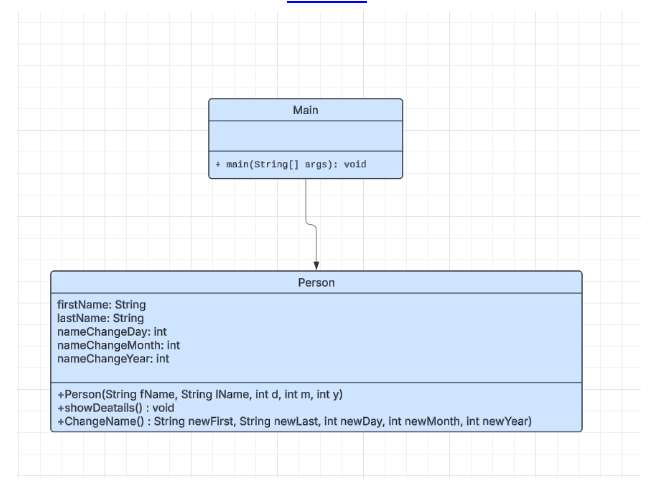

# Lab 01 – Exercise 01  
## Name Management System

In this exercise, I implemented a simple Name Management System in Java.

The goal was to create a program that allows a person to change their name, but only if at least three years have passed since the last name change.

---

## Task Overview

The program includes:

- A `Person` class with:
  - first name
  - last name
  - date of last name change (day, month, year)

- Methods:
  - Constructor to initialize all attributes
  - `showDetails()` to display stored information
  - `changeName()` to update the name if the 3-year rule is fulfilled

In the `main` method:
- Three `Person` objects are created.
- The user selects which person to modify.
- The program checks whether the name change is allowed.
- The updated data is displayed.

User input is handled using `Scanner`.

---

## UML Diagram

  

---
